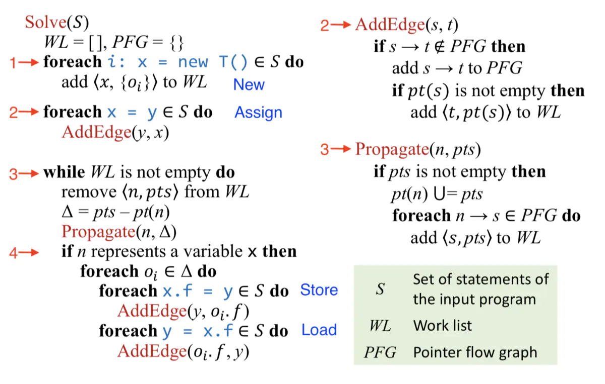

# Chapter 7 PTA FD

参考PPT Chapter7_PTA-FD(I,II) 指针分析基础

[TOC]

## 指针分析规则

**指针分析的域和数学表示**

<b>图7-1 指针分析数学表示</b>

其中$P(O)$代表对象集合$O$的幂集，所以$pt(p):Pointer \rightarrow P(O)$也就代表着指针所指向的对象集合（必然是对象集合$O$的子集）

**指针分析规则**

<b>图7-2 指针分析规则1</b>

New 语句：只需要将初始化的变量加入到变量x指向的对象集合即可。

Assign 语句：将变量y中所有的对象，copy进变量x所指向的对象集合

Store 语句：将变量x所指向的对象集合中所有对象$o_i$的实例字段指向变量y所指向的对象集合中所有对象$o_j$

Load 语句：将变量y所指向的对象集合中所有对象$o_j$指向变量x所指向的对象集合的所有变量$o_i$的实例字段f

<b>图7-3 指针分析规则2</b>

## 如何实现指针分析

**算法要求：**完整的全程序指针分析，便于理解和实现。

**指针分析本质：**指针分析本质上就是在指针之间传递指向信息。

**实现的关键：**当$pt(x)$发生变化，如何将这一变化传递到与指针x相关的部分。

**解决方案：**通过构建图来连接相关指针，当$pt（x）$发生变化，将改变的部分传递至$x$的后继。

**p.s :**用**指针流图（PFG）**来表示之间的关系，PFG是有向图(有向图可以表达对象是如何在程序指针之间的流动)。

- Nodes：$Pointer = V \ \bigcup\ (O\times F)$

  节点n代表一个变量或者一个抽象对象的字段（field）

- Edges：$Pointer \times Pointer$

  边$x \rightarrow y$表示指向指针x的变量也可能指向y变量

**PFG Edge**

<b>图7-4 PFG Edge</b>

**示例：**

<b>图7-5 PFG示例</b>

图7-5中，通过左边的程序指令构建完成PFG，然后通过初始化变量b,也就是$o_j \in pt(b)$,我们可以在途中很清晰的看出变量在指针之间的流动。

**实现指针分析两部分：**

1. 构建PFG(指向流图)
2. 在PFG上传播指向信息

这两部分是相互依赖，PFG会在指针分析的过程中进行动态更新。

## 过程内指针分析算法

<b>图7-6 过程内 PTA算法</b>

**符号：**

1. S：输入程序语句的集合
2. WL: Work List，待合并的指针信息，二元组的集合，例子：$<x,\{ o_i \}>$，$o_i$加入到$pt(x)$中。$WL \subseteq<Pointer,P(O)>$
3. PFG：指向流图

**步骤：**

1. 对S中所有类似**New**语句 x = new T()，将$<x,{o_i}>$加入到WL。（初始化分析）
2. 对S中所有类似**Assign**语句 x = y, 调用AddEdge() 将$y \rightarrow x$加入到PFG，并将$<x,pt(y)>$加入到WL中。
3. 遍历WL，取其中一个元素$<n,pts>$，取$pts和pt(n)$差集，调用$propagate(n, \Delta)$函数将$\Delta$加入到$pt(n)$，并从PFG中找出所有n指向的边（也就是说寻找n的后继）$n \rightarrow s$，并将$<s,pts>$加入WL（根据PFG将指向信息传递给同名指针）。
4. 如果指针n代表变量x，则对于$\forall oi\in \Delta$,对S 中所有类似**Store 语句** $x.f=y$，调用AddEdge()将$y\rightarrow o_i.f$加入到PFG，$<o_i.f,pt(y)>$加入到WL（传播指向信息）；对S 中所有类似**Load语句**$y=x.f$，调用AddEdge(）将$o_i.f\rightarrow y$加入到PFG,$<y,pt(o_i.f)>$加入到WL（传播指向信息）。

**问题：**

1. 为什么在调用$propagate()$函数前进行去重操作？避免冗余，提高效率，这一去重操作也被称为differential propagation(差异传播)
2. 指针集存储数据结构？
3. 开源项目有哪些？Soot、WALA、Chord。

**示例：**

见PPT 69-90

<b>图7-7 过程内PTA算法</b>

## 过程间指针分析算法

**CHA**:基于声明类型，不精确，引入错误的调用边和指针关系

**指针分析**:基于$pt(a)$,即a指向的类型，更精确，构造更准的CFG并对指针分析有正反馈（所以过程间指针分析和CG构造同时进行，较为费时）。

#### 调用语句规则

